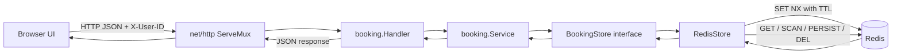

# Cinema Booking

A Go cinema booking prototype for studying seat-booking concurrency. The project evolves from an unsafe in-memory map, to a mutex-protected store, to Redis-backed atomic seat holds using `SET NX`.

## System Design



### Booking Flow

1. The browser loads `GET /movies`.
2. Selecting a movie calls `GET /movies/{movieID}/seats`.
3. Selecting a free seat calls `POST /movies/{movieID}/seats/{seatID}/hold`.
4. The store tries to create `seat:{movieID}:{seatID}` with Redis `SET NX` and a seven-minute TTL.
5. Redis accepts exactly one concurrent writer. Other writers receive a booking conflict.
6. The successful hold receives a session ID and a reverse key: `session:{sessionID}` -> seat key.
7. The user either confirms the session or releases it.

## Project Structure

```text
.
├── cmd/
│   └── main.go                  # HTTP server, routes, movie catalog
├── internal/
│   ├── adapters/redis/
│   │   └── redis.go             # Redis client construction and health check
│   ├── booking/
│   │   ├── domain.go            # Booking and BookingStore contracts
│   │   ├── service.go           # Application/service layer
│   │   ├── handler.go           # HTTP handlers and JSON DTOs
│   │   ├── redis_store.go       # Distributed Redis implementation
│   │   ├── memory_store.go      # Basic, non-thread-safe learning implementation
│   │   ├── concurrent_store.go  # Mutex-protected in-memory implementation
│   │   └── service_test.go      # High-contention Redis test
│   └── utils/
│       └── utils.go             # Shared JSON response helper
├── static/
│   └── index.html               # Browser client and seat grid
├── docker-compose.yaml          # Redis and Redis Commander
├── go.mod
└── README.md
```

## Design Evolution

### 1. Plain Map

The first implementation stored bookings in a Go map:

```go
if _, exists := bookings[seatID]; exists {
    return ErrSeatAlreadyBooked
}
bookings[seatID] = booking
```

This is unsafe under concurrent requests. Multiple goroutines can observe the seat as free, and concurrent map writes can also trigger a runtime failure.

### 2. Mutex-Protected Map

`ConcurrentStore` protects the check-and-write operation with a mutex:

```go
mu.Lock()
defer mu.Unlock()

if _, exists := bookings[seatID]; exists {
    return ErrSeatAlreadyBooked
}
bookings[seatID] = booking
```

This works for one Go process. It does not coordinate multiple application instances, and all traffic for the same data must effectively share one process memory.

### 3. Redis Atomic Reservation

`RedisStore` moves the reservation decision to Redis:

```text
SET seat:{movieID}:{seatID} <booking-json> NX EX 420
```

`NX` means create only when the key does not exist. Redis processes this command atomically, so concurrent application instances can compete for the same seat without a Go mutex shared between them. The TTL releases an abandoned hold automatically.

## Repository Pattern

The service depends on the `BookingStore` interface, not directly on Redis:

```go
type BookingStore interface {
    Book(Booking) (Booking, error)
    ListBookings(movieID string) []Booking
}
```

This keeps the service layer independent from storage. The application can use `MemoryStore`, `ConcurrentStore`, or `RedisStore` without changing the core booking call. Redis-specific session operations are exposed through a small optional interface used by confirmation and release.

## Running Locally

Requirements:

- Go 1.25 or compatible newer Go toolchain
- Docker Desktop with its Linux engine running

Start the dependencies:

```powershell
docker compose up -d
```

Run the server from the repository root:

```powershell
go run ./cmd
```

Open `http://localhost:8080`.

Useful commands:

```powershell
go test ./...
go test ./internal/booking -run TestConcurrentBooking_ExactlyOneWins -count=1
go vet ./...
docker compose config --quiet
docker compose down
```

The high-contention test uses a unique movie ID on every run so an old Redis hold cannot make every request fail.

## API Documentation

The current prototype identifies users with the `X-User-ID` request header. This is only a demo identity mechanism; it is not authentication.

### `GET /movies`

Returns the in-memory movie catalog.

Response `200`:

```json
[
  {
    "id": "inception",
    "title": "Inception",
    "rows": 5,
    "seats_per_row": 8
  }
]
```

### `GET /movies/{movieID}/seats`

Returns booked seats for a movie. Seats not returned are available and are generated by the browser from the movie dimensions.

Response `200`:

```json
[
  {
    "seat_id": "A1",
    "user_id": "user-123",
    "booked": true,
    "confirmed": false
  }
]
```

### `POST /movies/{movieID}/seats/{seatID}/hold`

Headers:

```text
X-User-ID: user-123
```

Response `201`:

```json
{
  "session_id": "uuid",
  "movie_id": "inception",
  "seat_id": "A1",
  "expires_at": "2026-09-06T12:00:00Z"
}
```

Possible errors:

- `400` when `X-User-ID` is missing
- `409` when another hold already owns the seat
- `500` for an unexpected storage failure

### `PUT /sessions/{sessionID}/confirm`

Headers:

```text
X-User-ID: user-123
```

Response `200`:

```json
{
  "ID": "uuid",
  "MovieID": "inception",
  "SeatID": "A1",
  "UserID": "user-123",
  "Status": "confirmed"
}
```

### `DELETE /sessions/{sessionID}`

Headers:

```text
X-User-ID: user-123
```

Response: `204 No Content`.

## Interview Questions and Answers

### General Evolution

**Q1. What did you implement first?**

An in-memory map. It was useful for establishing the booking behavior, but it was not safe for concurrent access and did not coordinate across processes.

**Q2. Why is a plain map insufficient?**

A check followed by a write is not automatically one operation. Two goroutines can both see a free seat before either writes. Concurrent map writes are also unsafe in Go.

**Q3. What did the mutex solve?**

The mutex made the check-and-write critical section exclusive within one process. It solved data races and double booking among goroutines sharing that process.

**Q4. What did the mutex not solve?**

It did not coordinate separate server instances. Each process would have its own map and its own lock, so two processes could still book the same seat.

**Q5. Why introduce a repository interface?**

The service should express booking operations, not know whether data lives in a map or Redis. `BookingStore` makes storage replaceable and keeps the application layer easier to test.

**Q6. What is the consistency boundary?**

The seat key creation is the critical decision. Redis must atomically decide which request owns the key. The session reverse lookup and later confirmation are additional state transitions that need careful error handling and, for production, stronger atomicity.

**Q7. How did you test concurrency?**

The test starts 100,000 goroutines competing for one seat and uses atomic counters. The expected result is exactly one success and 99,999 failures. It uses a unique movie ID to avoid stale keys from earlier tests.

### Redis

**Q1. Why Redis for seat holds?**

Redis is shared by multiple application instances, supports atomic conditional writes, and has native expiration. It is a good fit for short-lived seat holds with high contention.

**Q2. How does `NX` prevent double booking?**

`SET key value NX` succeeds only when the key does not exist. Redis serializes the command, so only one concurrent caller can create the seat key.

**Q3. Why use a TTL?**

A user can abandon checkout. The seven-minute TTL prevents an abandoned hold from blocking the seat forever.

**Q4. What Redis keys are used?**

`seat:{movieID}:{seatID}` stores the booking JSON. `session:{sessionID}` points back to the seat key, allowing confirmation and release to find the seat from a session ID.

**Q5. Why is a reverse session key useful?**

The client receives a session ID, not a seat key. The reverse key lets the server locate the seat without scanning all movie seats.

**Q6. What happens if the reverse key fails after the seat key succeeds?**

The current implementation deletes the seat key as a compensating action. A production implementation should use a Lua script or another atomic transaction to create both keys together.

**Q7. Why is `SCAN` used for listing?**

`SCAN` iterates incrementally and avoids the blocking behavior of `KEYS` on a large Redis database. The current prototype should eventually use a more explicit index for predictable listing.

**Q8. Is confirmation fully atomic?**

Not currently. The implementation writes the confirmed booking and persists keys in separate commands. A production version should use a Lua script or `MULTI/EXEC`, validate the hold state, and make the whole transition atomic.

**Q9. What happens if Redis is unavailable?**

The adapter fails during startup because it pings Redis. In production, prefer a bounded startup policy, health checks, request timeouts, and an explicit degraded-mode decision.

### Docker

**Q1. What does Docker Compose provide here?**

It starts Redis and Redis Commander on one Compose network. The Go process running on the host connects to Redis through `localhost:6379`.

**Q2. Why does the container-to-container host use `redis`?**

Compose creates service DNS names. Redis Commander connects to the Redis service as `redis:6379`, while the host Go process uses the published `localhost:6379` port.

**Q3. What does `docker compose up -d` do?**

It creates or starts the defined containers in detached mode, allowing the terminal to be used for `go run` or tests.

**Q4. How do you inspect the deployment?**

Use `docker compose ps` for container status, `docker compose logs redis` for Redis logs, and `docker compose config --quiet` to validate the Compose file.

**Q5. What should be improved for production Docker usage?**

Pin image versions or digests, add health checks, avoid exposing Redis publicly, use secrets where needed, configure persistence deliberately, and run only the services required by the deployment.

## Security and Reliability Review

This is a learning prototype. The following issues should be addressed before production use:

- `X-User-ID` is client-controlled and provides no authentication or authorization.
- Redis is exposed on host port `6379` without authentication or TLS.
- Redis Commander is a development tool and is exposed on host port `8081`.
- The Redis Commander image uses the floating `latest` tag.
- The HTTP server has no explicit read, write, or idle timeouts.
- Redis calls use `context.Background()` in some paths instead of request-scoped deadlines.
- Confirmation uses multiple Redis commands rather than one atomic state transition.
- Redis errors are ignored while listing bookings, which can turn an infrastructure failure into an incomplete `200` response.
- `Release` ignores the result of `DEL`.
- The in-memory stores key bookings by `SeatID` only, so identical seat IDs across movies collide. They are educational stores, not production alternatives.
- The service exposes storage capability checks through a type assertion for confirmation/release; a larger application would usually model these operations explicitly in its repository interface.

## Next Production Improvements

1. Replace the demo user header with authenticated identity from middleware.
2. Add request-scoped Redis timeouts and HTTP server timeouts.
3. Make hold, confirm, and release transitions atomic with Lua scripts or transactions.
4. Add integration tests for expiry, confirmation, release, wrong-user access, and Redis failures.
5. Use a persistent movie and seat catalog rather than generating seats from static dimensions.
6. Pin Docker images and keep Redis private to the application network.
